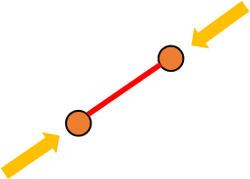
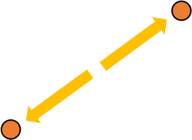
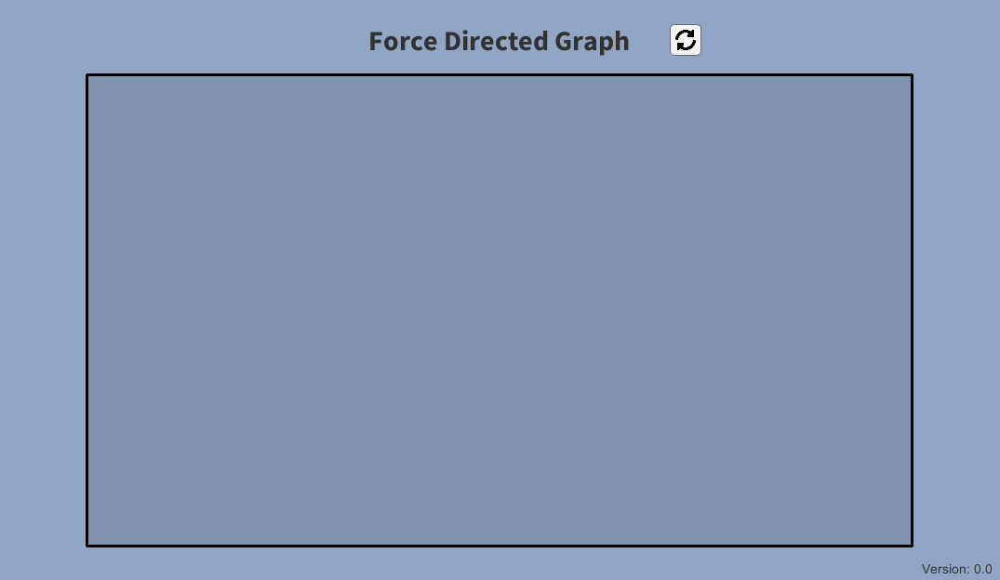
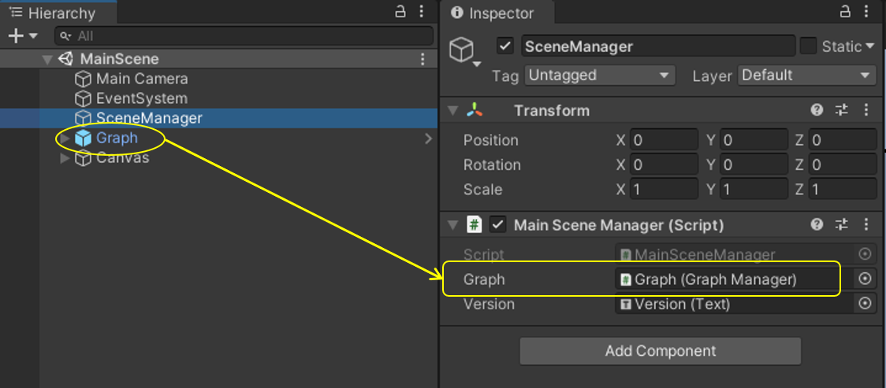
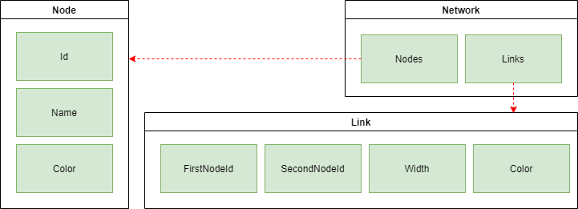

# Force-Directed-Graph

This project provides the implementation of force directed graph visualization. This visualization is commonly used to display social networks in a pleasing and easy-to-understand way [- wikipedia](https://en.wikipedia.org/wiki/Force-directed_graph_drawing). 

` IMPORTANT: The code is not optimized for handling large number of nodes. Instead, it takes advantage of Unity3d physics engine to create the visualization. `

A force-directed graph can be achieved by following two simple rules:

* **Attraction** force is applied to connected nodes => pulling them toward each other.
* **Repulsion** force is applied to disconnected nodes when they are in close proximity => pushing each other away.

` For demo purposes, any node being dragged ignores all forces applied to it. `

| Attraction | Repulsion |
| :-----: | :-------: |
|  |    |

# Demo



We created a demo that visualizes the force directed graph of a simple sample network.
A complete demo can be found on [https://omaddam.github.io/Force-Directed-Graph/](https://omaddam.github.io/Force-Directed-Graph/).

# Getting Started

These instructions will get you a copy of the project on your local machine for development and testing purposes.

### Prerequisites

The things you need to install before you proceed with development:

1) [Unity3d (2020.2.0f1)](https://unity3d.com/get-unity/download/archive) [required].

### Installing

A step by step guide to get you started with development.

#### Download, clone, and setup the repository

```git
git clone https://github.com/omaddam/Force-Directed-Graph.git
```

#### Initialize git flow

```git
git flow init
```

# How to use this visualization in your project?

### 1. Add prefab
Add Graph.prefab into your scene and reference its manager in your script. `The prefab can be found under Assets/ForceDirectedGraph/Prefabs.`



### 2. Prepare data
Create a `ForceDirectedGraph.DataStructure.Network` instance and populate it with the nodes and links.

Every node has the following fields:
* Unique identifier
* Display name
* Color

Every link has the following fields:
* Id of the first node
* Id of the second node
* Width `[0-1]` representing the strength of the connection between the two nodes
* Color

```C#
using ForceDirectedGraph;
using UnityEngine;
using System;

// Create network
DataStructure.Network network = new DataStructure.Network();

// Add nodes
network.Nodes.Add(new DataStructure.Node(Guid.NewGuid(), "Item 1", Color.red));
network.Nodes.Add(new DataStructure.Node(Guid.NewGuid(), "Item 2", Color.blue));
network.Nodes.Add(new DataStructure.Node(Guid.NewGuid(), "Item 3", Color.green));

// Add links
network.Links.Add(new DataStructure.Link(
    network.Nodes[0].Id, network.Nodes[1].Id, 0.5f, Color.white)); // Item 1 -> Item 2
network.Links.Add(new DataStructure.Link(
    network.Nodes[0].Id, network.Nodes[2].Id, 0.5f, Color.white)); // Item 1 -> Item 3
network.Links.Add(new DataStructure.Link(
    network.Nodes[1].Id, network.Nodes[2].Id, 0.5f, Color.white)); // Item 2 -> Item 3
```

### 3. Visualize network
Used the referenced graph manager to visualize the network.

```C#
/// <summary>
/// The graph displaying the network.
/// </summary>
[SerializeField]
[Tooltip("The graph displaying the network.")]
private GraphManager Graph;

// Display network
Graph.Initialize(network);
```

# Standards

### General Standards

* Line ending: CRLF
* Case styles: Camel, Pascal, and Snake case
  * Arguments, paramters, and local variables: camel case (e.g. graphNode)
  * Global variables: pascal case (e.g. NodeTemplate)
  * Constants and static variables: snake case (ALL CAPS) (e.g. REPULSION_FORCE)
* Methods naming convention:
  * Pascal case (e.g. GenerateSample)
  * Verbs

### Commenting Standards

* `///` Summaries: Full-usage of English grammar and punctuation. (e.g. Add periods to the end of your summaries, as if you were writing a phrase or sentence.)
*  `//` In-line comments: quick, point-form. Grammar and punctuation not needed

### Assets / App

* Contains scripts, scenes, and all resources used to create the demo application.
* Scripts are created under Assets/App/Scripts folder.

### Assets / Others

* All components should be included under Assets/\<Name> folder. (e.g. Assets/ForceDirectedGraph)
* Each component should be isolated and under **NO CIRCUMSTANCES** referencing or using another component's scripts.
* Components are **NOT** allowed to reference or call application/demo scripts.

# Code Based Documentation

## Assets / ForcedDirectedGraph

This folder contains an implementation of force-directed graph system that visualizes social networks. The system consists of three components in addition to the data structure.

### DataStructure

The data structure contains 3 classes as shown in the figure below.



* **Network**: represents the social network being visualized in the graph.
  * Properties
    * **Nodes**: list of all nodes to be displayed.
    * **Links**: list of all links that define the connections between the nodes.

* **Node**: represents a single item in the graph.
  * Properties
    * **Id**: unique identifier used when linking nodes together.
    * **Name**: displayed name of the node.
    * **Color**: color used when representing the node.

* **Link**: represents a single connection between two nodes.
  * Properties
    * **FirstNodeId**: id of the node connected to the link's head.
    * **SecondNodeId**: id of the node connected to the link's tail.
    * **Width**: normalized weight of the link [0-1]. The higher the value is, the closer the nodes get to each other.
    * **Color**: The color used when displaying the link.

### GraphNode

A *GraphNode* represents a 2D circle on a graph. It is used as a template by the graph component when displaying the nodes.
* Prefab: Assets/ForcedDirectedGraph/Prefabs/GraphNode.prefab
* Script: Assets/ForcedDirectedGraph/Scripts/GraphNode.cs
  * Initialize: sets the color and displayed name of the circle.
  * ApplyForces: applies forces to the circle to set its position.

The graph node prefab also includes another script that allows the user to drag the circle around. While dragging the circle, all applied forces get ignored.
* Script: Assets/ForcedDirectedGraph/Scripts/Draggable.cs

### GraphLink

A *GraphLink* is used to to draw lines between nodes. It is used as a template by the graph component when displaying the connections between nodes.
* Prefab: Assets/ForcedDirectedGraph/Prefabs/GraphLink.prefab
* Script: Assets/ForcedDirectedGraph/Scripts/GraphLink.cs
  * Initialize: sets the two *GraphNode* elements that should be connected.

### Graph
